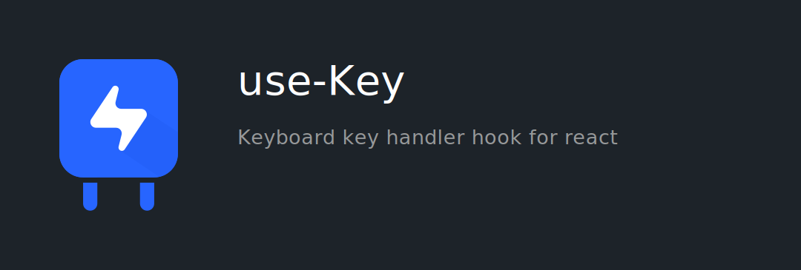

# @rooks/use-key


   


## About 
keypress, keyup and keydown event handlers as hooks for react.

## Installation

```
npm install --save @rooks/use-key
```

## Importing the hook

```javascript
import useKey from "@rooks/use-key";
```

## Usage

#### Basic example with keydown

```jsx
function Demo() {
  const inputRef = useRef();
  function windowEnter(e) {
    console.log("[Demo 1] Enter key was pressed on window");
  }
  function vowelsEntered(e) {
    console.log("[Demo 1] You typed a vowel");
  }
  function capitalVowelsEntered(e) {
    console.log("[Demo 1] You typed a capital vowel");
  }
  // window is the target
  useKey(["Enter"], windowEnter);
  useKey(["a", "e", "i", "o", "u"], vowelsEntered, {
    target: inputRef
  });
  useKey(["A", "E", "I", "O", "U"], capitalVowelsEntered, {
    target: inputRef
  });
  return (
    <>
      <p>Press enter anywhere to trigger a console.log statement</p>
      <p>Press a,e,i,o,u in the input to trigger a console.log statement</p>
      <p>Press A,E,I,O,U in the input to trigger a different log statement</p>
      <input ref={inputRef} />
    </>
  );
}

render(<Demo />);
```

#### Multiple kinds of events

```jsx
function Demo() {
  const inputRef = useRef();
  function onKeyInteraction(e) {
    console.log("[Demo 2]Enter key", e.type);
  }

  useKey(["Enter"], onKeyInteraction, {
    target: inputRef,
    eventTypes: ["keypress", "keydown", "keyup"]
  });
  return (
    <>
      <p>Try "Enter" Keypress keydown and keyup </p>
      <p>
        It will log 3 events on this input. Since you can listen to multiple
        types of events on a keyboard key.
      </p>
      <input ref={inputRef} />
    </>
  );
}
render(<Demo />);
```

#### Conditionally setting handlers

```jsx
function Demo() {
  const inputRef = useRef();
  const [shouldListen, setShouldListen] = useState(false);
  function toggleShouldListen() {
    setShouldListen(!shouldListen);
  }
  function onKeyInteraction(e) {
    console.log("[Demo 3] Enter key", e.type);
  }

  useKey(["Enter"], onKeyInteraction, {
    target: inputRef,
    eventTypes: ["keypress", "keydown", "keyup"],
    when: shouldListen
  });
  return (
    <>
      <p>
        Enter key events will only be logged when the listening state is true.
        Click on the button to toggle between listening and not listening
        states.{" "}
      </p>
      <p>
        Handy for adding and removing event handlers only when certain
        conditions are met.
      </p>
      <input ref={inputRef} />
      <br />
      <button onClick={toggleShouldListen}>
        <b>{shouldListen ? "Listening" : "Not listening"}</b> - Toggle{" "}
      </button>
    </>
  );
}
render(<Demo />);
```
