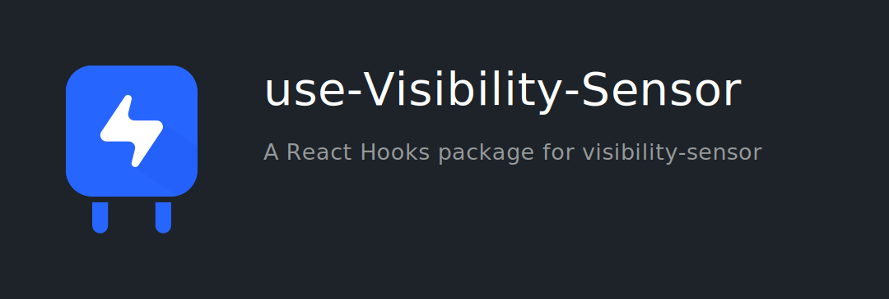

# @rooks/use-visibility-sensor


   


## About 
Visibility sensor hook for React.
<br/>


## Installation

```
npm install --save @rooks/use-visibility-sensor
```

## Importing the hook

```javascript
import useVisibilitySensor from "@rooks/use-visibility-sensor"
```


## Usage

```jsx

function Demo() {
    const rootNode = useRef(null);
    const { isVisible, visibilityRect } = useVisibilitySensor(rootNode, {
        intervalCheck: false,
        scrollCheck: true,
        resizeCheck: true
    });
    return (
        <div ref={rootNode}>
        <p>
            {isVisible ? "Visible" : isVisible === null ? "Null" : "Not Visible"}
        </p>
        </div>
    );
}

render(<Demo/>)
```

It checks whether an element has scrolled into view or not. A lot of the logic is taken from [react-visibility-sensor](https://github.com/joshwnj/react-visibility-sensor) and is rewritten for the hooks proposal.

> **Note:** This is using the new [React Hooks API Proposal](https://reactjs.org/docs/hooks-intro.html)
> which is subject to change until React 16.7 final.
>
> You'll need to install `react`, `react-dom`, etc at `^16.7.0-alpha.0`

## Demo

[](https://gyazo.com/98634bb2a962733670d798d1e754d63e)

### Returned Object keys

| Returned object attributes | Type    | Description                                                 |
| -------------------------- | ------- | ----------------------------------------------------------- |
| isVisible                  | Boolean | Is Ref visible or not                                       |
| visibilityRect             | Object  | VisibilityRectangle containing coordinates of the container |

## Options

The first argument of the `useVisibilitySensor` hook is a ref, the second argument is an options object. The available options are as follow:

`intervalCheck: false` - Accepts `int | bool`, if an `int` is supplied, that will be the interval in `ms` and it keeps checking for visibility

`partialVisibility: false` - Accepts `bool | string` : Tells the hook if partial visibility should be considered as visibility or not. Accepts `false` and directions `top`, `bottom`, `left` and `right`

`containment: null` - A `DOMNode` element which defaults to `window`. The element relative to which visibility is checked against

`scrollCheck: true` - A `bool` to determine whether to check for scroll behavior or not

`scrollDebounce: 250` - The debounce ms for scroll

`scrollThrottle: -1` - The throttle ms for scroll. If throttle > -1, debounce is ignored.

`resizeCheck: false` - A `bool` to determine whether to check for resize behavior or not

`resizeDebounce: 250` - The debounce ms for resize

`resizeThrottle: -1` - The throttle ms for resize. If throttle > -1, debounce is ignored.

`shouldCheckOnMount: true` - A `bool` which determines whether an initial check on first render should happen or not.

`minTopValue: 0` - An `int` top value to determine what amount of top visibility should be considered for `visibility`

## Todo

- [x] Init
- [x] Scroll and Resize support
- [x] Debounce and throttling
- [x] Option to opt-out of initial check on mount
- [x] Documentation of all options
- [x] Tests _ WIP _
- [ ] More examples _ WIP _
